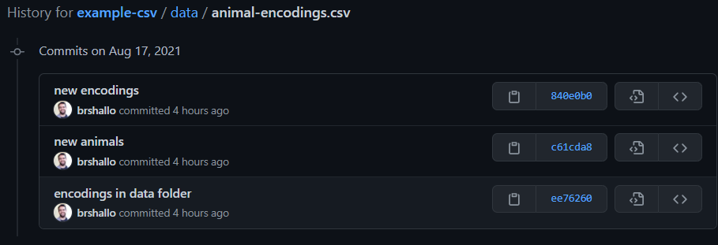

<!-- README.md is generated from README.Rmd. Please edit that file -->

# Save all versions of file from a git repo

`save_file_versions_from_git()` is set-up to make it easy to save all
versions of a file from a git repository to a new folder. See
“scripts/save\_file\_versions\_from\_git.R” for documentation on
arguments in function.

## Problem statement

The [example-csv](https://github.com/brshallo/example-csv) repository
contains a made-up .csv file of a data dictionary of codes for different
types of animals. These codes have changed over time. The history of
these changes can be seen by reviewing the git history of the file.



Pretend we work at this zoo and are reviewing a variety of older
datasets that have old encodings on them. We may need older versions of
the “data/animal-encodings.csv” data dictionary file to understand them.
In some cases we may want to save all versions of the file to a new
folder location.

## Steps of function

`save_versions_from_git()` does the following:

1.  Clones repository locally (or pull if have cloned previously)
2.  Create new folder and “commits.txt” file specifying all previous
    versions of the file
3.  Save each version of the file into this new folder (default is for
    output folder name to be auto-generated based on repo and file name
    passed in as arugments).
4.  Output the files in the output folder (all versions from git history
    of specified file).

(Again, see documentation “scripts/save\_file\_versions\_from\_git.R”
for arguments and other things can do.)

Example:

``` r
# Load in function
source(here::here("scripts", "save_file_versions_from_git.R"))

# Run function using our animal-encodings data dictionary
save_file_versions_from_git(
  repo_https = "https://github.com/brshallo/example-csv.git",
  file_path_in_repo = "data/animal-encodings.csv",
  delete_clone = TRUE
  )
#> versions_example-csv_animal-encodings/840e0b0_2021-08-17.csv
#> versions_example-csv_animal-encodings/c61cda8_2021-08-17.csv
#> versions_example-csv_animal-encodings/ee76260_2021-08-17.csv
```

# Notes and Cautions

-   Is set-up using a mix of R and bash calls via `system()` – with a
    little more effort could have written the whole thing using bash (to
    reduce dependencies) and made a little bit cleaner.
-   The R `system()` calls may be Windows specific (not sure current
    set-up would run on other OS’s).
-   In addition to R, requires that git and bash are installed – though
    doesn’t do any checks for this.
-   I imagine more elegant solutions for “get all verisons of a data
    dictionary from a git repository” could be set-up using
    [pins](https://github.com/rstudio/pins) or other tools.
-   Naming convention is not 100% safe from duplicates and oddities. For
    example, if a repository has another file with the same name but in
    a different folder and `save_file_versions_from_git()` is run from
    the same project on with `file_path_in_repo` of both
    “folder/file\_abc.csv” and “file\_abc.csv” versions from files on
    each run would be sent to “versions\_repository\_file\_abc” (with no
    clear way of differenatiating) and
    “versions\_repository\_file\_abc/commits.txt” would only contain the
    most up-to-date.
    -   In other words: use with caution
